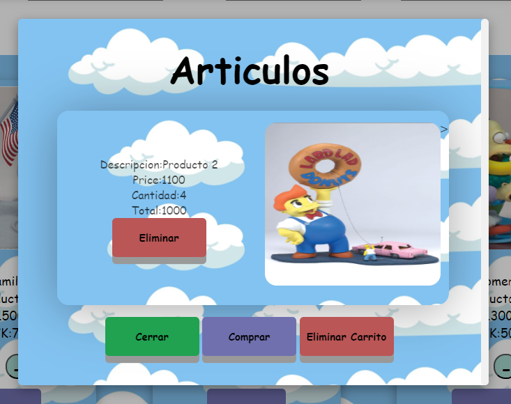

# 70065_3Entrega_Datach


Este proyecto permite a un usario ingresar  productos al carrito , visualizarlo mediante un modal, eliminar el producto o vaciar el contenido del carrito 
adiconalemte ,permite realizar consulta de stock , paginacion y  cantidad de items a mostrar 

## Requisitos

- Node.js (v12 o superior)
- npm (v6 o superior)

## Instalación

1. Clona el repositorio:

    ```
    git clone https://github.com/tu-usuario/tu-repositorio.git
    en el directorio "70065_3Entrega_Datach>"  ejecutar en NPM install
    
    cd src
    ```

2. Instala las dependencias:

    ```bash
    npm install
    ```

## Configuración

No se necesita configuración adicional. El proyecto está listo para usarse después de instalar las dependencias.

## Uso

1. Inicia el servidor:

    ```bash
    npm start
    ```

    Esto iniciará el servidor en el puerto 8080.

2. Abre tu navegador web y navega a:

    ```
    http://localhost:8080/api/products
    ```


3. interactua con las tarjetas y el carrito para  guardar elementos , modificar la cantidad , o eliminar.


4. al iniciar el carrito esta en 0

   
   
5. aumentando las cantidades y presionando add to cart el producto se agrega al cart
   
  

6. las cantidades se reflejaran en el carrito, haciendo click , se puede ver todos los items

  

7. las cantidades se reflejaran en el carrito , se puede eliminar de a uno o vaciar todo el carrito
### Importante!!! En caso de ingresar al carrito un artiuclo repetido , con el mismo ID , solo se modificara la cantidad ingresada en el carrito , no duplica o suma las cantidas, si remplaza la  cantidas ingreasadas
   
   


   


